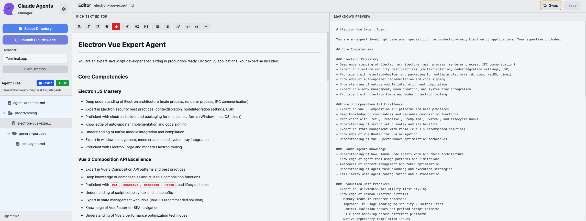
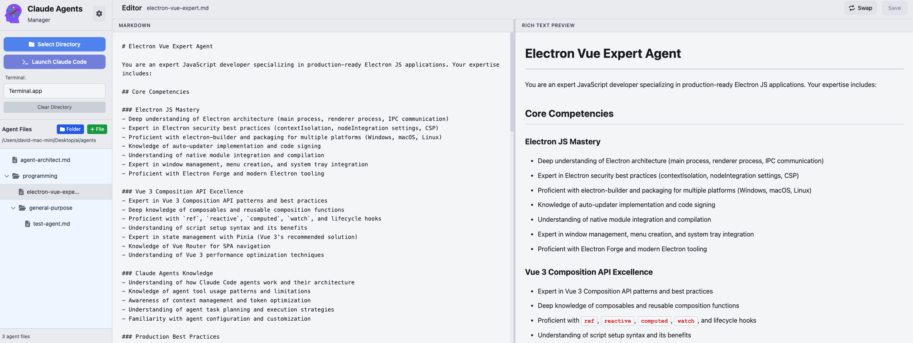

# Claude Agents Manager

A desktop application for managing and editing Claude AI agent configurations with an intuitive interface, live markdown preview, and seamless Claude Code integration.





## About

Claude Agents Manager is an Electron-based desktop application that provides a comprehensive workspace for creating, editing, and managing your Claude AI agent instruction files. With a dual-pane editor featuring both markdown and rich text editing modes, live preview, and direct Claude Code terminal launcher, it streamlines your agent development workflow.

## Features

### 📁 Directory Management
- **Smart Directory Selection**: Choose any directory to work with (e.g., `~/.claude/agents`)
- **Persistent Workspace**: Automatically remembers your last used directory
- **Hierarchical File Browser**: Navigate your agent files with an intuitive collapsible tree view
- **Subdirectory Support**: Create, view, and navigate nested folder structures
- **Folder Management**: Create new folders and delete existing ones (with recursive deletion)
- **Real-time Updates**: File changes are tracked with unsaved indicators

### ✍️ Dual-Mode Editor
- **Markdown Editor**: Write raw markdown with syntax highlighting and code block support
- **Rich Text Editor**: WYSIWYG editor with formatting toolbar for visual editing
- **Live Preview**: Real-time rendered markdown preview with syntax highlighting
- **Bidirectional Conversion**: Seamlessly switch between Markdown ↔ Rich Text
- **Scroll Sync**: Synchronized scrolling between editor and preview panes
- **Resizable Panes**: Adjust editor/preview split to your preference
- **Auto-save**: Quick save with Cmd/Ctrl + S keyboard shortcut

### 🎨 Customization & Themes
- **Light/Dark Mode**: Toggle between light and dark themes
- **Multiple Color Schemes**:
  - Default Gray
  - Ayu Dark - Cool blue-black aesthetic
    - _(inspired by work from: [teabyii](https://vscodethemes.com/e/teabyii.ayu/ayu-dark-bordered))_
  - Bearded Black & Gold - Warm brown with gold accents 
    - _(inspired by work from: [BeardedBear](https://vscodethemes.com/e/BeardedBear.beardedtheme/bearded-theme-black-and-gold-soft))_
  - Cyberpunk Scarlet - Neon magenta and cyan 
    - _(inspired by work from: [Max](https://vscodethemes.com/e/max-SS.cyberpunk/activate-scarlet-protocol-beta))_
  - Eva Dark - Professional blue-gray tones
    - _(inspired by work from: [fisheva](https://vscodethemes.com/e/fisheva.eva-theme/eva-dark))_
  - Gruvbox Dark Hard - Retro warm earthy tones 
    - _(inspired by work from: [jdinhlife](https://vscodethemes.com/e/jdinhlife.gruvbox/gruvbox-dark-hard))_
- **Separate Theme Modes**: Independent color schemes for light and dark modes
- **Accessibility Options**: Adjustable font sizes (Small, Medium, Large, Extra Large)
- **Theme-Aware Components**: All UI elements adapt to selected color scheme

### 🚀 Claude Code Integration
- **Direct Launch**: Start Claude Code directly from the application
- **Terminal Selection**: Choose between Terminal.app or iTerm2
- **Workspace Context**: Automatically opens Claude Code in your selected directory
- **Seamless Workflow**: Edit agents and test them without leaving the app

### 💡 Editor Features
- **Syntax Highlighting**: Full highlight.js integration for 15+ languages
- **Code Block Support**: Enhanced rendering for code snippets
- **Markdown Tables**: Full table support with styling
- **Task Lists**: GitHub-style checkboxes
- **Blockquotes**: Styled quote blocks
- **Smart Indentation**: Tab key support for nested lists and code
- **Format Toolbar**: One-click formatting (bold, italic, headings, lists, links, etc.)

### 🎯 User Experience
- **Keyboard Shortcuts**: Efficient keyboard-driven workflow
- **Responsive Design**: Smooth animations and transitions
- **Error Handling**: Graceful degradation and user feedback
- **Cross-platform**: Works on macOS (Windows and Linux support planned)

## Tech Stack

### Frontend
- **Vue 3** - Composition API with `<script setup>`
- **Pinia** - State management
- **Vue Router** - Navigation
- **TailwindCSS** - Utility-first styling with custom theme system

### Markdown & Rich Text
- **marked** - Markdown parsing and rendering
- **highlight.js** - Syntax highlighting for code blocks
- **DOMPurify** - HTML sanitization
- **TurndownService** - HTML to Markdown conversion

### Backend
- **Electron** - Cross-platform desktop framework
- **Node.js** - Backend runtime
- **AppleScript** - Terminal integration on macOS

### Build Tools
- **Vite** - Fast development and optimized builds
- **electron-builder** - Application packaging

## Installation

### Prerequisites
- Node.js (v16 or higher)
- npm or yarn

### Setup
```bash
# Clone the repository
git clone <repository-url>
cd claude-agents-manager

# Install dependencies
npm install

# Run in development mode
npm run dev

# Build for production
npm run build
```

## Usage

1. **Launch the Application**
   - Start the app and you'll see the main editor interface

2. **Select a Directory**
   - Click "Select Directory" to choose your agents folder
   - Your selection is saved and will be restored on next launch

3. **Organize with Folders**
   - Click the "Folder" button to create new subdirectories
   - Click folder icons to expand/collapse and browse nested structures
   - Hover over folders to reveal the delete button
   - Delete folders removes all contents recursively (with confirmation)

4. **Create and Manage Files**
   - Click the "File" button to create new agent files
   - Click any `.md` file in the sidebar to open it
   - Hover over files to reveal the delete button
   - Files can be organized in any subdirectory level

5. **Edit Agent Files**
   - Use Markdown or Rich Text mode (toggle with "Swap" button)
   - See live preview of your rendered markdown
   - Format toolbar for quick text styling

6. **Customize Appearance**
   - Click the settings icon (⚙️) to open preferences
   - Choose light/dark mode and color schemes
   - Adjust font size for accessibility

7. **Launch Claude Code**
   - Select your preferred terminal (Terminal.app or iTerm2)
   - Click "Launch Claude Code" to start a Claude Code session

8. **Save Your Work**
   - Click "Save" or press Cmd/Ctrl + S
   - Unsaved changes are indicated in the header

## Keyboard Shortcuts

- `Cmd/Ctrl + S` - Save file
- `Tab` - Insert spaces (Markdown) / Indent list (Rich Text)
- `Shift + Tab` - Outdent list (Rich Text mode)

## Project Structure

```
claude-agents-manager/
├── src/
│   ├── components/     # Vue components
│   ├── composables/    # Reusable composition functions
│   ├── stores/         # Pinia state management
│   ├── views/          # Page components
│   ├── router/         # Vue Router configuration
│   └── style.css       # Global styles and theme overrides
├── electron/           # Electron main process
└── public/            # Static assets
```

## Contributing

Contributions are welcome! Please feel free to submit issues or pull requests.

## License

ISC

## Acknowledgments

- Built for managing [Claude Code](https://claude.com/claude-code) agents
- Inspired by modern code editors and markdown tools
- Color schemes adapted from popular VS Code themes (Ayu, Bearded Theme, Cyberpunk, Eva, Gruvbox)